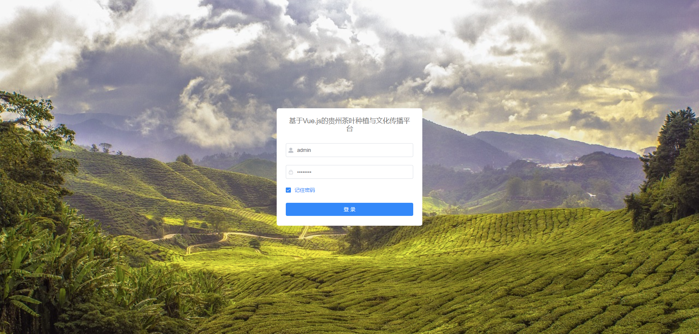
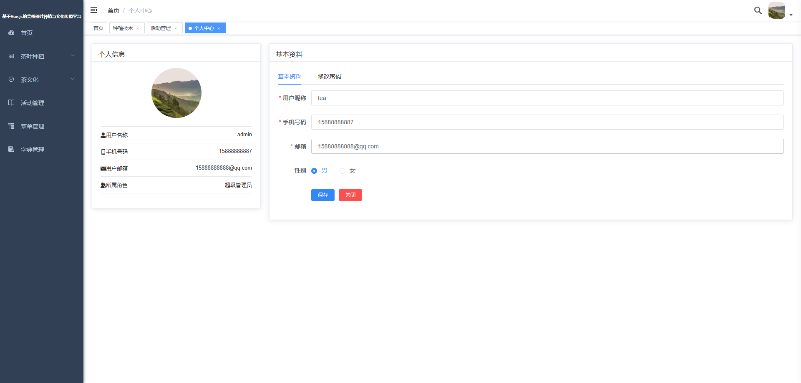
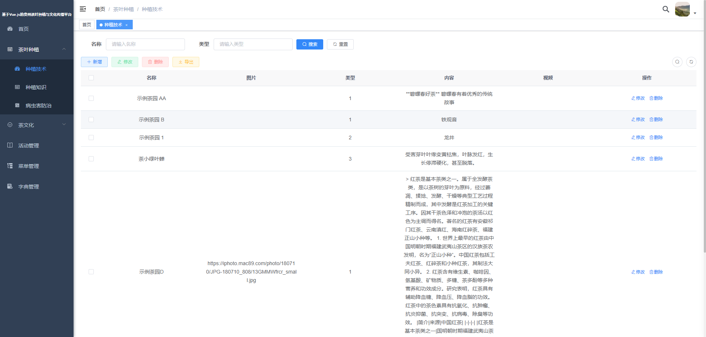
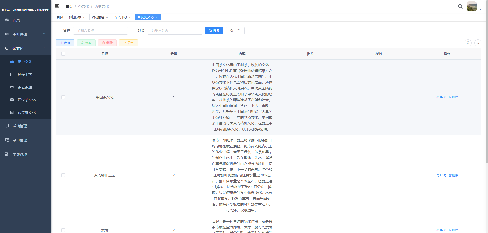

<p align="center">
	
</p>
<h1 align="center" style="margin: 30px 0 30px; font-weight: bold;">Yolo Blog</h1>
<h4 align="center">基于SpringBoot+Vue前后端分离的Java快速开发平台</h4>

## 项目简介
* 项目初衷是提供一个极简易搭建，以及修改的前后台功能完善的系统。
* 整套系统有视频讲解，定制化需求可以联系作者咨询。

## 后台管理系统简介
> 账号: `admin`，密码: `admin123`

* 前端采用Vue、Element UI。
* 后端采用Spring Boot、Spring Security、Redis & Jwt。
* 权限认证使用Jwt，支持多终端认证系统。
* 支持加载动态权限菜单，多方式轻松权限控制。
* 高效率开发，使用代码生成器可以一键生成前后端代码。

## 路径

* 前端 /ruoyi-ui
* 后端 /ruoyi-admin

## 内置功能

1.  用户管理：用户是系统操作者，该功能主要完成系统用户配置。
2.  菜单管理：配置系统菜单，操作权限，按钮权限标识等。
3.  角色管理：角色菜单权限分配、设置角色按机构进行数据范围权限划分。
6.  字典管理：对系统中经常使用的一些较为固定的数据进行维护。
7.  参数管理：对系统动态配置常用参数。

## 演示图






## 前台系统简介

> 账号: `admin`，密码: `admin123`

### 前台成品展示

`主页` :

`详情页` :

`活动预约` :

`个人管理页` :

### 技术

`前端` :
* element-ui
* axios
* vue

`后端` :
* hibernate validatior
* mybatis plus
* springboot
* mysql
* shiro
* redis
* jwt

#### 本地运行该项目
1. 前端 : 进入blog-vue，打开cmd窗口，使用npm运行该项目 `npm run serve`

2. 后端 :
- 使用sql脚本生成对应的数据库
- 用java的idea打开blog-springboot
- 配置`application.yml`，
- 修改对应的数据库连接参数，redis的端口号
```

### 技术

`前端` :
* element-ui
* axios
* vue

`后端` :
* hibernate validatior
* mybatis plus
* springboot
* mysql
* shiro
* redis
* jwt

#### 本地运行该项目
1. 前端 : 进入blog-vue，打开cmd窗口，使用npm运行该项目 `npm run serve`

2. 后端 :
- 使用sql脚本生成对应的数据库
- 用java的idea打开blog-springboot
- 配置`application.yml`，
- 修改对应的数据库连接参数，redis的端口号
```

