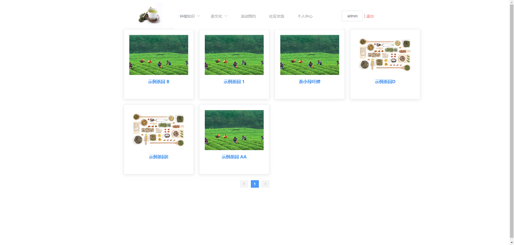
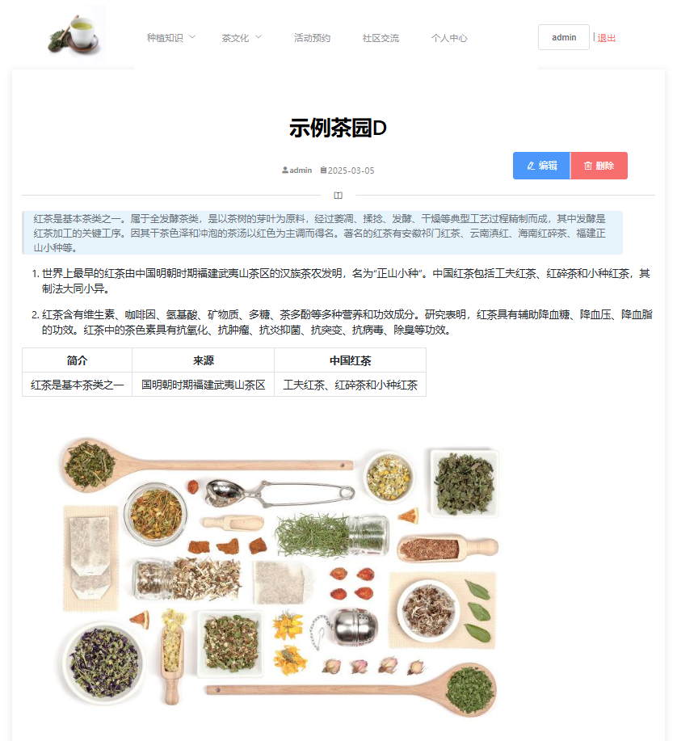
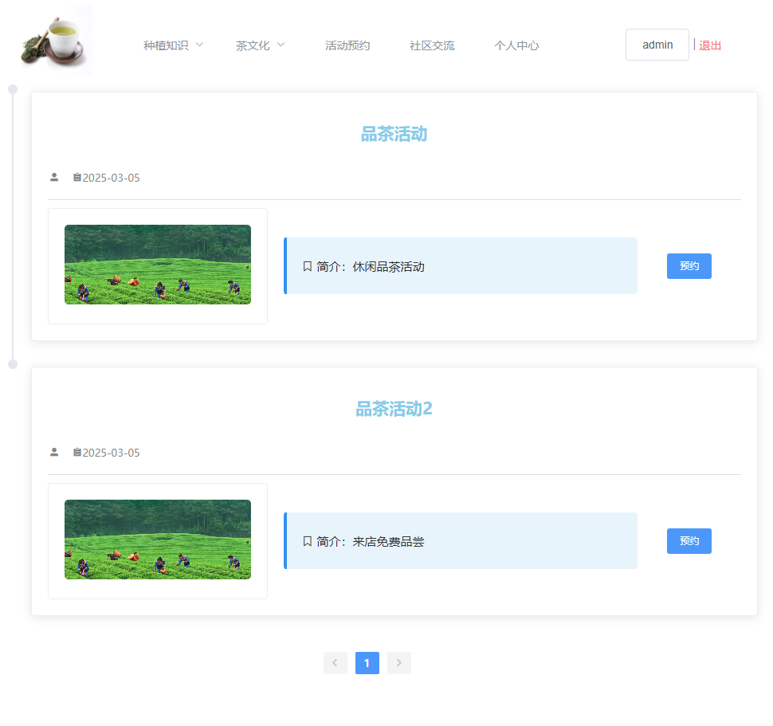
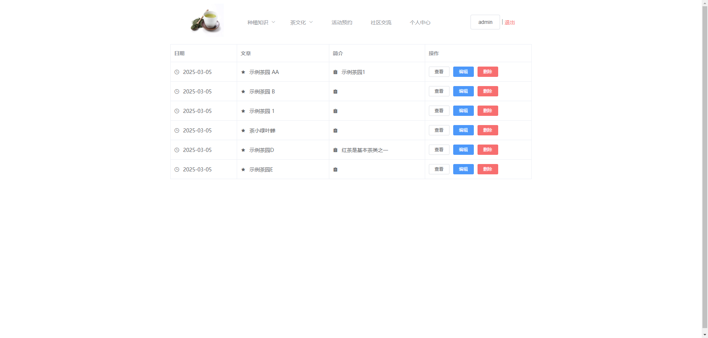

> 账号: `admin`，密码: `admin123` 

### 前台成品展示

`主页` :

`详情页` :

`活动预约` :

`个人管理页` :

### 技术

`前端` : 
* element-ui
* axios
* vue

`后端` : 
* hibernate validatior
* mybatis plus
* springboot
* mysql
* shiro
* redis
* jwt

#### 本地运行该项目
1. 前端 : 进入blog-vue，打开cmd窗口，使用npm运行该项目 `npm run serve`

2. 后端 : 
- 使用sql脚本生成对应的数据库
- 用java的idea打开blog-springboot
- 配置`application.yml`，
- 修改对应的数据库连接参数，redis的端口号
```

